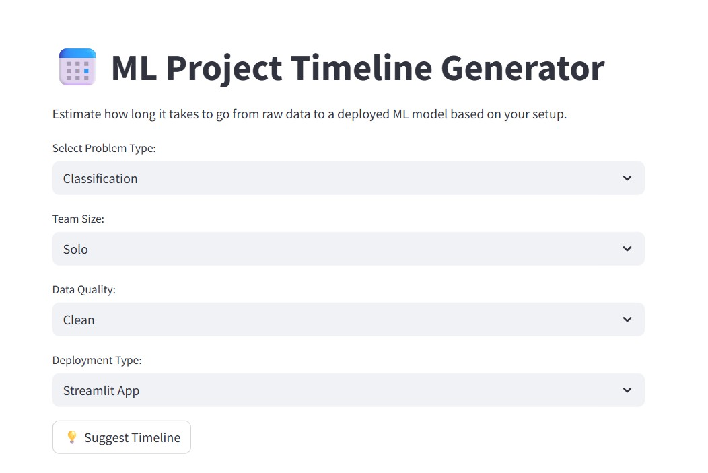

# 📅 ML Project Timeline Generator

An interactive Streamlit app that helps you estimate the realistic time needed to build and deploy a machine learning model — based on your problem type, team size, data quality, and deployment method.

---

## 🚀 Features

- Select your ML problem type: Classification, Regression, or Clustering
- Choose team size and data cleanliness level
- Pick a deployment method: Streamlit App, REST API, or Enterprise Pipeline
- Get a curated phase-by-phase timeline with estimated working days
- Suggested stack/tools for each type

---

## 📸 Demo



---

## 📝 How to Run Locally

```bash
git clone https://github.com/your-username/ml-timeline-generator.git
cd ml-timeline-generator
pip install -r requirements.txt
streamlit run ml_timeline_generator.py
```

---

## 🛠️ Tech Stack

- Python
- Streamlit
- Git + GitHub
- VSCode

---

## 🤝 Connect with Me

- 💼 [LinkedIn – Jeslin Lois](https://www.linkedin.com/in/jeslin-lois/)
---

---

## 🧠 Related Blog Posts

Here’s a deeper dive into the thoughts and learning behind this project:

1. ✍️ [How to Choose the Right Evaluation Metric – A Simple Guide](https://medium.com/@jeslinloisss/how-to-choose-the-right-evaluation-metric-for-a-model-a-simple-guide-315817d990fe)
2. 🧪 [How to choose the Right Machine Learning model — A simple, honest guide](https://medium.com/@jeslinloisss/how-to-choose-the-right-machine-learning-model-a-simple-honest-guide-3ff603f621fa)

✨ More coming soon — follow me on [Medium](https://medium.com/@jeslinloisss) for updates!

---

## 🙌 Special Thanks

To everyone who ever paused at “Which model should I use?” — this tool is for you 💛  